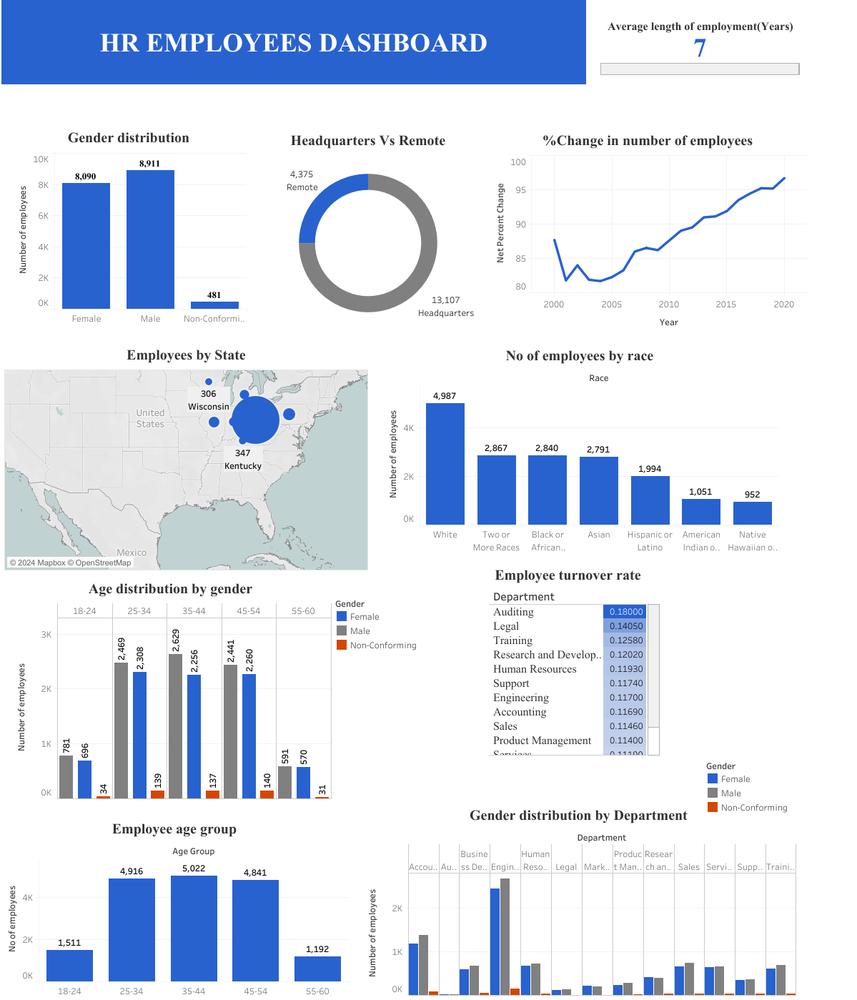

## HR EMPLOYEES PROJECT

### Project Overview 
The project used employee data to uncover trends in employee behaviour and demographics, and also looked at employee turnover rates. 
### Data Used
The dataset used was a large dataset, with more than 20,000 rows, with employee information. 
### Tools Used 
1. MySQL - Data Cleaning and Analysis 
2. Tableau - Data Visualization/ Dashboard Creation
### Data Cleaning
In the data cleaning process, I performed the following tasks
- Data loading and inspection 
- Creation of new columns eg age
- Data formatting to ensure data integrity
### Exploratory Data Analysis
The questions that I wanted to answer from this dataset are as follows. 
1. What is the gender distribution of employees in the company?
2. What is the ethnicity/race breakdown of employees?
3. How is age distributed among the employees?
4. What is the ratio of employees who work in headquarters vs remote locations?
5. What is the average age of employees in the company for those that have been terminated?
6. How does gender distribution vary across various departments?
7. What is the distribution of job titles across the company?
8. Which department has the highest turnover rate?
9. What is the distribution of employees by state?
10. How has the employee count changed over the years?
11. What is the tenure distribution for each department? 
### Summary of findings 
According to the analysis performed, some of the findings are as follows
- There are more male employees than female and non-conforming employees in the organization 
- The highest number of employees is white and the least number is either Native Hawaiian or American Indian
- Most employees are between 25-34, followed by 35-44, and there are fewer employees between ages 55-64
- More employees work in the headquarters than those who work remote
- Average age of employment before an employee leaves the company is 7 years 
- The Marketing department has the highest turnover rate, followed by Training. The department with the lowest turnover rate is in Research and development, Support and Legal departments. 
- Distribution of employees is fairly balanced in different departments, but male employees are more by a small margin. 
- Ohio has the largest number of employees. 
- The number of employees has increased throughout the years.
- The average tenure for the departments is 8 years, with Legal and Auditing having the highest tenure and Services, Sales, and Marketing having the lowest tenure. 
### Recommendations
- Efforts towards inclusivity and diversity can be increased, so that minority groups can be represented better in the organization.
- Investigation in the Marketing and Training departments should be made to find the reasons for the high turnover rate, and how to overcome them. One of the methods to reduce turnover rate includes introducing training and development oportunities, as well as creating room for better work-life balance.
- Given that most employees are young, mentorship can be organized by the employees with more experience, so that they can grow within the company. 
- More remote opportunities can be introduced, where possible, to attract talent from various locations. 
- The average tenure is 7 years, and the company may come up with strategies to encourage employee retention such as compulsory promotions after certain years and better growth opportunities. 
- The company should try and expand operations in states with the least employees, so that talent may be more balanced geographically.
- 
### Limitations 
1. Some of the data was unrealistic, such as having dates from the future, which were not included in my results. Only dates less than the current date were included. 
2. After calculating the ages and creating a new column, some of the ages were negative, but I only used data for employees who were 18 years and above. 

